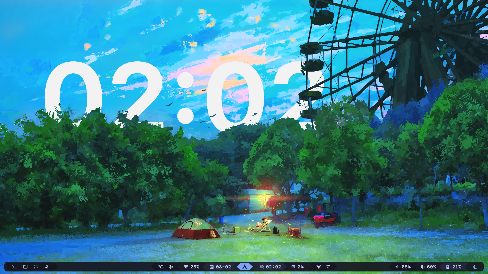
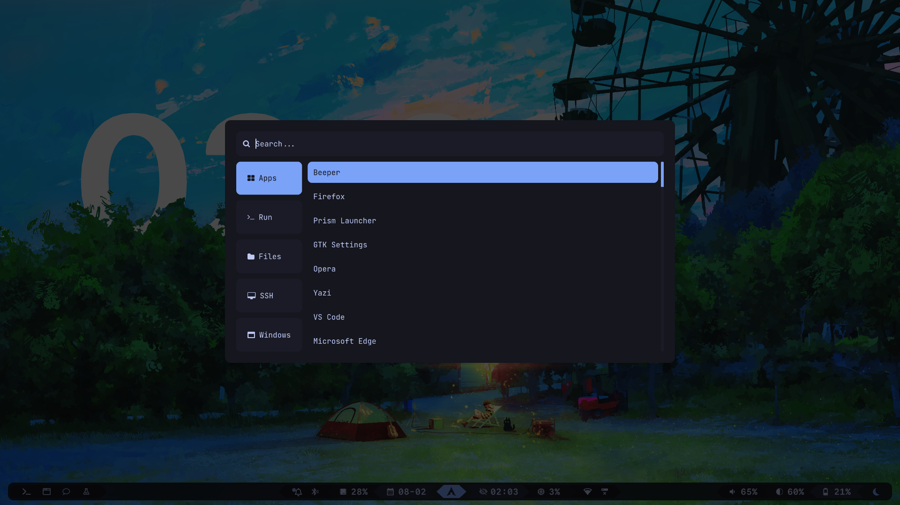
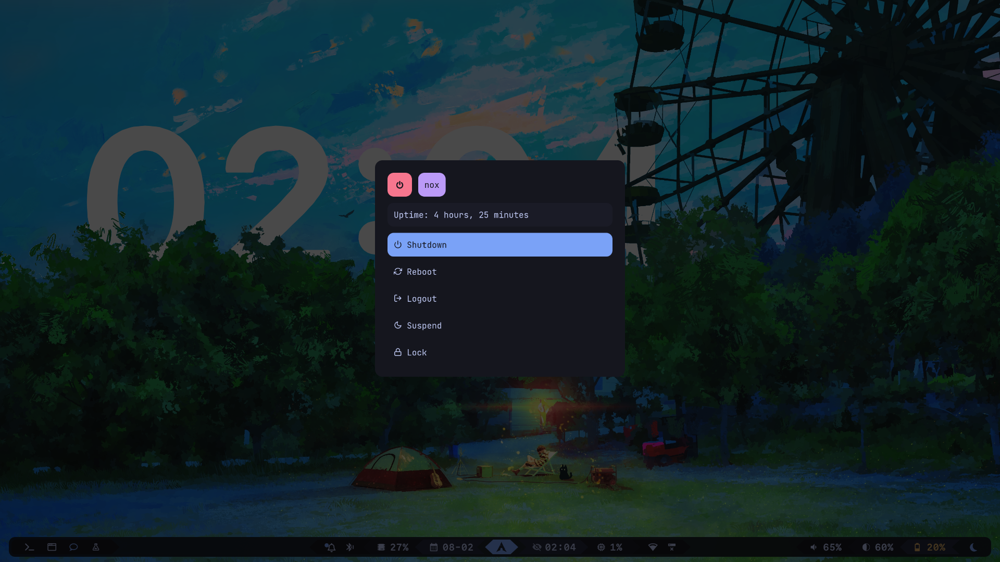
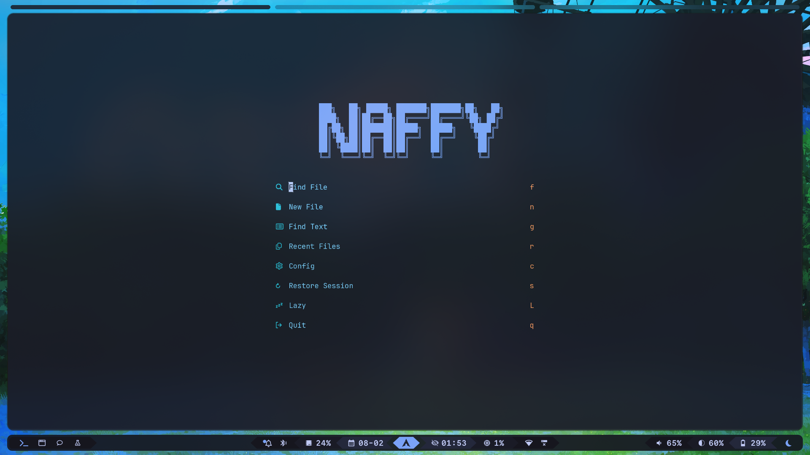
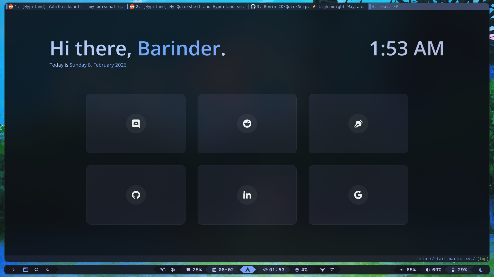

# Dotfiles

Personal Arch Linux dotfiles featuring Hyprland, Tokyo Night theming, and extensive Rofi integration. Automated bootstrap script handles everything from base system setup to desktop environment configuration.



## Showcase

| Launcher  | Powermenu |
|-----------|-----------|
|  |  |

| Neovim      | Qutebrowser |
|-------------|-------------|
|  |  |

> Additional Rofi menu screenshots (clipboard, notes, todo, timer, etc.) will be added in a sandbox environment due to privacy concerns.

## System Info

**Hardware:**
- CPU: AMD Ryzen 7 7435HS
- GPU: NVIDIA GeForce RTX 3050 Mobile
- RAM: 16GB DDR5
- Display: 1920x1080 @ 144Hz (scaled 1.2x)

**Software Stack:**
- OS: Arch Linux
- Compositor: Hyprland (Wayland)
- Shell: Zsh + Oh My Zsh
- Terminal: Ghostty
- Editor: Neovim ([custom config](https://github.com/knownasnaffy/nvim))
- Browser: Qutebrowser
- Bar: Waybar
- Notifications: SwayNC
- Launcher/Menus: Rofi
- Theme: Tokyo Night
- And many more - check the config files ;)

## Features

- **Automated Setup**: Single script installs packages, configures system, and symlinks dotfiles with backup protection
- **Hyprland-First**: Wayland-native workflow optimized for laptop usage with NVIDIA support
- **Extensive Rofi Integration**: 20+ custom menus for everything from screenshots to password management
- **Vim-Centric Keybindings**: Ergonomic keyboard-first workflow (see [keyd config](etc/keyd/default.conf))
- **Modular Hyprland Config**: Split configuration files for maintainability
- **Smart Symlinking**: Idempotent with numbered backups (.bak, .bakN)
- **Partial Installation**: Granular flags for selective setup steps

## Quick Start

```bash
git clone https://github.com/knownasnaffy/dotfiles.git
cd dotfiles
./setup.sh            # full setup
./setup.sh --private  # include private packages (jrnl, etc.)
```

The script will:
1. Configure network (systemd-networkd + iwd)
2. Install base tooling (pacman + paru AUR helper)
3. Install 60+ packages (Hyprland stack, CLI tools, fonts, apps)
4. Setup Homebrew + bun, fnm, pipx
5. Configure Oh My Zsh with plugins
6. Clone Neovim config
7. Symlink all dotfiles (user + system configs)
8. Run post-install tasks (bat cache, xdg defaults, enable services)

## Package Highlights

**Hyprland Ecosystem:**
- hyprland, hyprlock, hyprpicker, hyprpolkitagent, hyprshade, hyprshutdown-git, hyprquickframe-git
- waybar, swaync, swayosd, uwsm
- grim, slurp, satty, wf-recorder, cliphist

**CLI Tools:**
- Shell: zsh, fzf, ripgrep, bat, eza, zoxide, btop, eva, jq, thefuck
- File Management: yazi, 7zip, ueberzug
- Dev: github-cli, aichat, task, pass (+ pass-otp)
- Media: playerctl, imagemagick

**Desktop Apps:**
- Terminal: ghostty
- Browser: qutebrowser
- PDF: zathura (+ poppler)
- Image: swayimg
- Communication: beeper-v4-bin

**Audio:**
- pipewire, pipewire-pulse, pipewire-alsa, wireplumber, alsa-utils

**Fonts:**
- ttf-hack-nerd, noto-fonts-emoji, inter-font

**System:**
- Display Manager: ly
- Keyboard Remapping: keyd
- Portal: xdg-desktop-portal-hyprland, xdg-desktop-portal-termfilechooser

## Rofi Menus

**Active Menus:**
- `launcher` - Application launcher
- `powermenu` - System power options
- `screenshot` - Screenshot/recording tools
- `pass` - Password manager interface
- `clipboard` - Clipboard history (cliphist)
- `emojipicker` - Emoji selector
- `colorpicker` - Color picker utility
- `characters` - Special characters
- `bookmarks` - Quick bookmarks
- `notes` - Note management
- `snippets` - Text snippets
- `todo` - Todo list manager
- `timer` - Countdown timer
- `hydrate` - Hydration reminder
- `recordscreen` - Screen recording
- `shader-toggle` - Hyprshade toggle
- `global` - Global menu aggregator

**Stale (Not in Use):**
- brightness, volume, wifi, battery, mpd, apps, appasroot, quicklinks

All menus are bound to keybindings in [hypr/land/keybinds.conf](.config/hypr/land/keybinds.conf).

## Configuration Structure

```
.
├── setup.sh                    # Main bootstrap script
├── docs/
│   └── assumptions.md          # System assumptions
├── etc/
│   ├── keyd/                   # Keyboard remapping
│   ├── ly/                     # Display manager config
│   └── systemd/network/        # Network configs
├── .config/
│   ├── hypr/                   # Hyprland (modular: land/*.conf)
│   ├── waybar/                 # Status bar (modular themes)
│   ├── rofi/                   # Launcher + applets
│   ├── swaync/                 # Notifications
│   ├── ghostty/                # Terminal
│   ├── qutebrowser/            # Browser
│   ├── neovim/                 # (Cloned separately)
│   ├── yazi/                   # File manager
│   ├── btop/                   # System monitor
│   ├── fastfetch/              # System info
│   └── [20+ other apps]
├── .local/
│   ├── bin/                    # Custom scripts
│   └── share/fonts/            # Custom fonts
└── media/
    ├── pictures/               # Wallpapers
    ├── music/                  # Notification sounds
    └── showcase/               # Screenshots
```

## Keybinding Philosophy

Vim-centric, keyboard-first workflow designed to minimize hand movement:

- **Caps Lock → Shift**: More ergonomic modifier
- **Alt-based combos**: Replaced most Ctrl bindings with Alt/Alt+Shift
- **Alt+Q → Escape**: Quick escape without reaching
- **Tab + {jkl;}**: Arrow keys on home row
- **Hyprland Super key**: Primary window management modifier

Full remapping details in [etc/keyd/default.conf](etc/keyd/default.conf).

## System Assumptions

From [docs/assumptions.md](docs/assumptions.md):

- Wayland-first (X11 via XWayland only)
- Hyprland as sole compositor
- Laptop-focused (internal display primary)
- Single-user system
- Private PC (no enterprise constraints)

## Selective Installation

Run specific setup steps with flags:

```bash
./setup.sh -nw        # Network setup only
./setup.sh -progs     # Install programs only
./setup.sh -ln        # Link dotfiles only
./setup.sh -pi        # Post-install scripts only
./setup.sh -zsh       # Setup Zsh only
./setup.sh -plugins   # Install Oh My Zsh plugins only
./setup.sh -dirs      # Create directories only
```

Combine flags as needed: `./setup.sh -ln -pi`

## Custom Scripts

Located in `.local/bin/`:

- `qutebrowser` - Qutebrowser wrapper with fixes
- `slurp` - Slurp wrapper for screenshots
- `crypt` - Encryption utility
- `git-status` - Enhanced git status
- `start-hotspot` / `stop-hotspot` - Mobile hotspot management
- `pass-push` - Password store sync

## Manual Setup Required

The following require manual configuration (documentation pending):

- **ydotool**: Virtual input automation
- **SDDM**: Alternative display manager (ly is configured)
- **Private configs**: Email (aerc), journaling (jrnl) - will be moved to separate repo

## Known Limitations

- **X11 apps**: Occasional glitches on Wayland (XWayland limitations). Qutebrowser has workarounds but bugs persist.
- **NVIDIA quirks**: Requires specific env vars (configured in hyprland.conf)
- **Personal software**: Currently mixed with system configs; will be separated into dedicated repo for sensitive data (mail, journal, etc.)

## Neovim Setup

If `~/.config/nvim` exists and points to `knownasnaffy/nvim`, it's preserved. Otherwise, the directory is removed and the config is cloned fresh.

Manual setup: `git clone https://github.com/knownasnaffy/nvim.git ~/.config/nvim`

## Troubleshooting

**Zsh not default shell:**
```bash
chsh $(id -un) --shell $(command -v zsh)
# Then log out and back in
```

**Symlink conflicts:**
Check permissions. Existing files may sometimes lead to conflict in `/etc` dir.


**Hyprland not launching:**
Last time I encountered this issue, it was because of postgresql, it's service was corrupting systemd. You can try disabling any such unit you enabled recently.

## Extending

1. Add new configs to appropriate directory in repo
2. Add `create_symlink` or `create_sudo_symlink` call in `link_dotfiles()` function
3. Keep changes idempotent (check before creating)
4. Group related symlinks together with comments

## Credits

- **Rofi themes**: Customized from various sources
- **Inspiration**: Countless dotfiles repos in the community
- Will try to complete this section soon

---

**Note:** This configuration is actively used and evolving. Expect frequent updates as workflows are refined.
