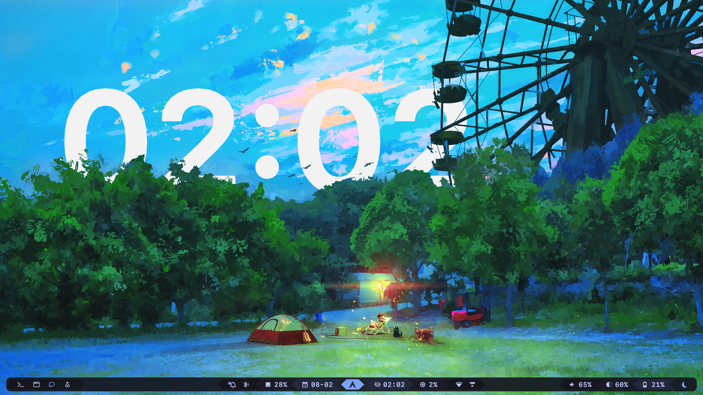
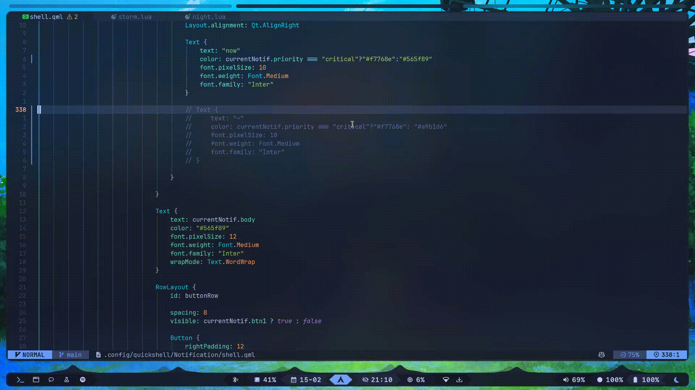
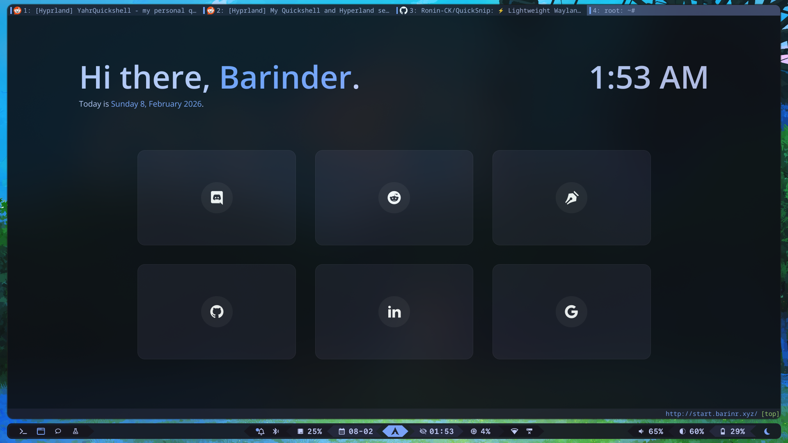
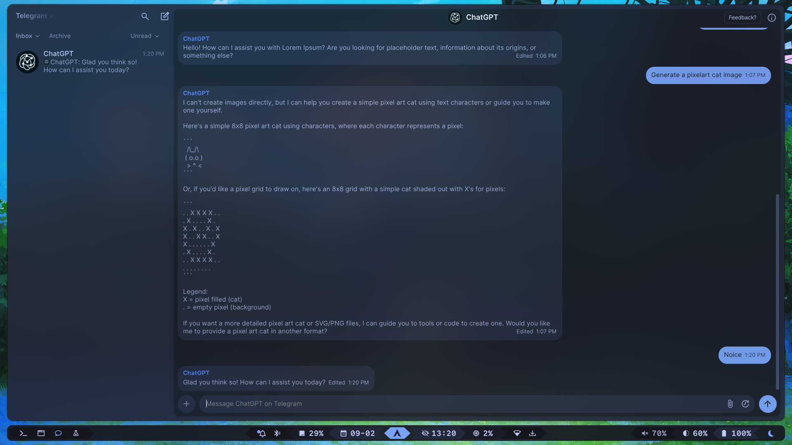
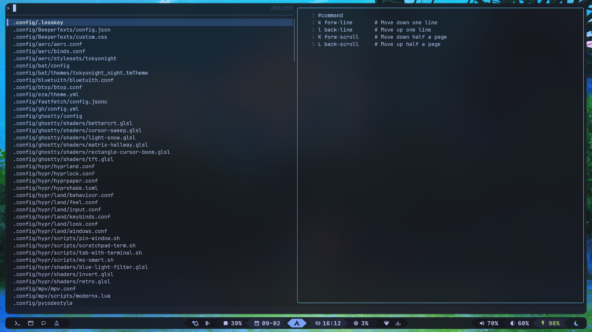
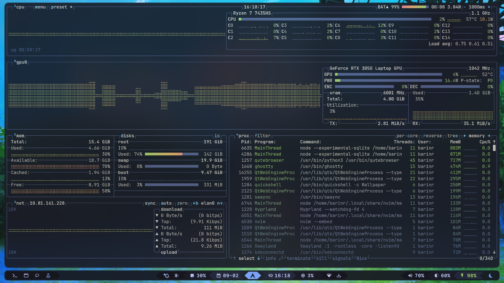
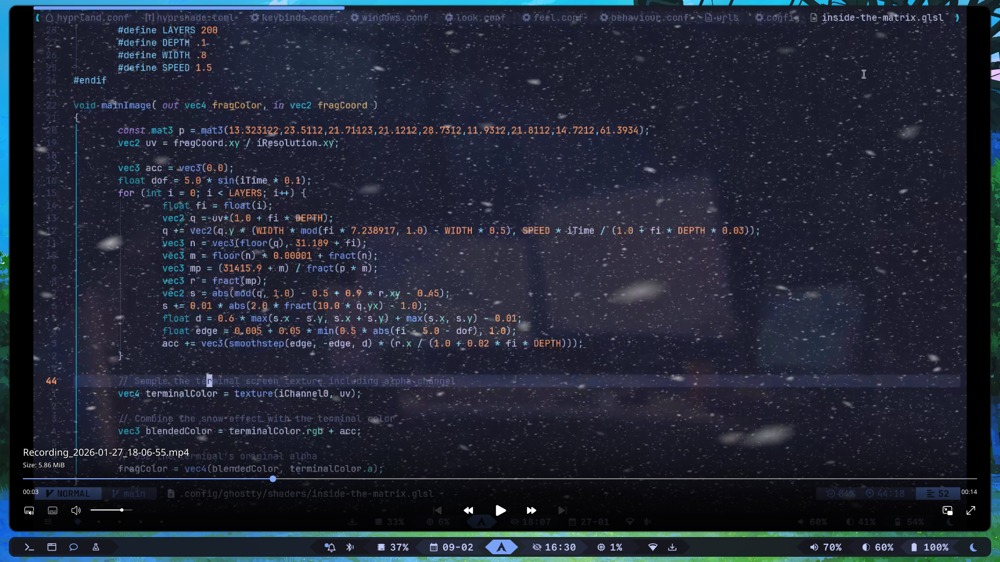
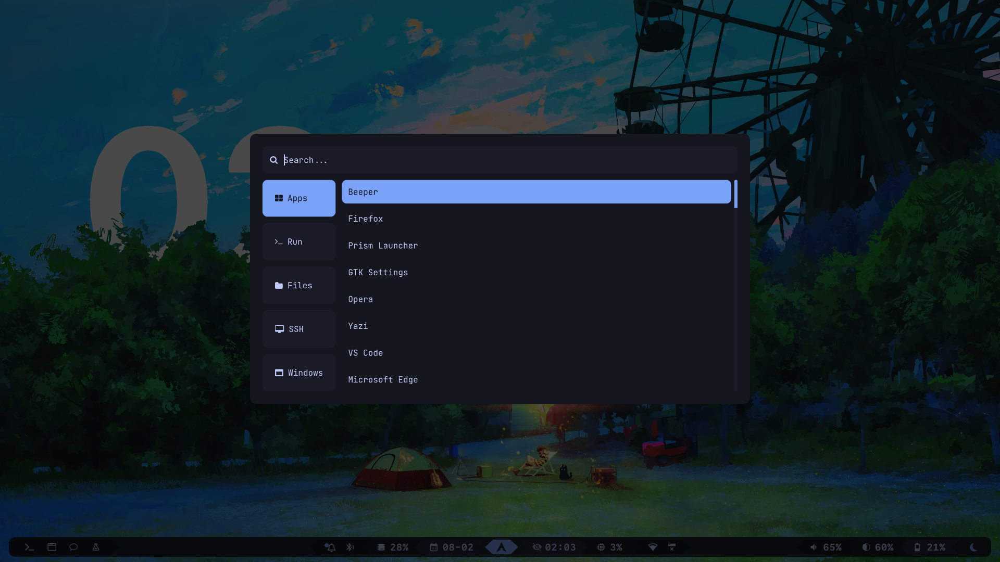

# Dotfiles

Personal Arch Linux dotfiles featuring Hyprland, Tokyo Night theming, and extensive Rofi integration. Automated bootstrap script handles everything from base system setup to desktop environment configuration. It was intended to be installed on a bare system, but will probably run just fine on top of existing configuration as backups are enabled.



## Showcase

> Some screenshots are outdated. Scrolling layout has been adapted. Audio visualizer has changed. Check [Quickshell Section](#quickshell) for more info.

<table>
  <tr>
    <th>Audio Visualizer</th>
    <th>Notifications (WIP)</th>
  </tr>
  <tr>
    <td align="center">
      
    </td>
    <td align="center">
      
    </td>
  </tr>
</table>

<table>
  <tr>
    <th>Neovim</th>
    <th>Qutebrowser</th>
  </tr>
  <tr>
    <td align="center">
      
    </td>
    <td align="center">
      
    </td>
  </tr>
</table>

<table>
  <tr>
    <th>Beeper</th>
    <th>Fzf</th>
  </tr>
  <tr>
    <td align="center">
      
    </td>
    <td align="center">
      
    </td>
  </tr>
</table>

<table>
  <tr>
    <th>Btop</th>
    <th>MPV</th>
  </tr>
  <tr>
    <td align="center">
      
    </td>
    <td align="center">
      
    </td>
  </tr>
</table>

<table>
  <tr>
    <th>Launcher</th>
    <th>Powermenu</th>
  </tr>
  <tr>
    <td align="center">
      
    </td>
    <td align="center">
      
    </td>
  </tr>
</table>

> Not all features can be showcased normally, will try in a sandboxed environment when possible.

## System Info

**Hardware:**
- CPU: AMD Ryzen 7 7435HS
- GPU: NVIDIA GeForce RTX 3050 Mobile
- RAM: 16GB DDR5
- Display: 1920x1080 @ 144Hz

## Features

- ~**Automated Setup**: Single script installs packages, configures system, and symlinks dotfiles with backup protection~ I think I broke a lot of stuff while trying quickshell and others
- **Hyprland-First**: Wayland-native workflow optimized for laptop usage ~with NVIDIA support~ (Nvidia is a b*ch)
- **Extensive Rofi Integration**: 20+ custom menus for everything from screenshots to password management (Will be converted to quickshell, I like it's extensibility)
- **Vim-Centric Keybindings**: Ergonomic keyboard-first workflow - ~hjkl~ jkl; (see [keyd config](etc/keyd/default.conf), [hyprland keybinds](.config/hypr/land/keybinds.conf))
- **Smart Symlinking**: Idempotent with numbered backups (.bak, .bakN)
- **Partial Installation**: Granular flags for selective setup steps

## Quick Start

```bash
git clone https://github.com/knownasnaffy/dotfiles.git
cd dotfiles
./setup.sh
```

The script will:
1. Configure network (systemd-networkd + iwd)
2. Install base tooling (pacman + paru AUR helper)
3. Install 60+ packages (Hyprland stack, CLI tools, fonts, apps)
4. Setup Homebrew, fnm, pipx
5. Configure *Latest* Oh My Zsh with plugins
6. Clone Neovim config
7. Symlink all dotfiles (user + system configs)
8. Run post-install tasks (bat cache, xdg defaults, enable services)

## Package Highlights

**Hyprland Ecosystem:**
- `hyprland`, `hyprlock`, `hyprpicker`, `hyprshade`, `hyprshutdown-git` (custom utillity), `hyprquickframe`, `quicksnip`, hyprpolkitagent
- `swaync`, `swayosd`, uwsm
- `wf-recorder`, `cliphist`, satty

**CLI Tools:**
- Shell: zsh, `omz`, `fzf`, `bat`, `zoxide`, `btop`
- File Management: `yazi`
- Dev: `aichat`, `pass` (+ pass-otp)

**Desktop Apps:**
- Terminal: `foot`
- Editor: `neovim` ([custom config](https://github.com/knownasnaffy/nvim))
- Browser: `vivaldi`
- PDF: `zathura`
- Image: `swayimg`
- Communication: `beeper`

## Selective Installation

Run specific setup steps with flags:

```bash
./setup.sh -nw        # Network setup only
./setup.sh -progs     # Install programs only
./setup.sh -ln        # Link dotfiles only
./setup.sh -pi        # Post-install scripts only
./setup.sh -zsh       # Setup Zsh only
./setup.sh -plugins   # Install Oh My Zsh plugins only
./setup.sh -dirs      # Create directories only
```

Combine flags as needed: `./setup.sh -ln -pi`

## Custom Scripts (quite helpful)

Located in `.local/bin/`:

- `qutebrowser` - Qutebrowser wrapper with fixes (Needed because of GPU thingy on wayland doesn't work)
- `slurp` - Slurp wrapper with custom theme (Why does this not support a config file?)
- `crypt` - Encryption utility (Kinda like an alias, maybe alias would've been better)
- `git-status` - git status accross an entire directory tree
- `start-hotspot` / `stop-hotspot` - Mobile hotspot management when ethernet is connected, breaks wifi (Ik, but I use iwd only)
- `pass-push` - Password store sync

Other useful menu utilities are located in `.config/rofi/applets/bin/`

## Manual Setup Required

The following require manual configuration (documentation pending):

- **ydotool**: Some input groups and other configurations
- **SDDM**: Theme and stuff not yet added to dotfiles (ly is configured if you want)

## Known Limitations

- **NVIDIA quirks**: Requires specific env vars (configured in hyprland.conf). Resume doesn't work (hibernate & sleep)

## Quickshell

- `bar` is under construction with quickshell.
  - `time` and `date`
  - `workspace` indicator
  - `battery` indicator
  - `speaker` volume, `mic` volume, `brightness`, `bluetooth` indicators with native Quickshell modules + OSD-like popup text when a value changes for volumes and brightness.
  - `wifi indicator` with my custom utility wrapper around iwdrs - [ryth](https://github.com/knownasnaffy/ryth). I plan to use it for a full wifi menu as iwd support doesn't seem like a priority thing for quickshell.
- `custom menu` is under work.
- `custom low battery indicator` (fullscreen) that forces you to plug in the charger (not very cruel, you do have a way out if you want to save your work)
- `wallpaper switcher` that supports images, videos and custom qml components (The depth effect wallpaper in the showcase is an example)
- `notification system` is under work - I'm too lazy to understand how ListView and animations work, will work on this once I do that.
- `powermenu` with only keyboard support (Maybe mouse works too, I think I used button click functionality initially)
- Some stale components are currently tracked in the repo, they were copied from other sources like [tpaau's config](https://github.com/tpaau/shell), but I didn't yet get the time to adapt them to my needs

## Credits

- **Rofi themes**: Customized from various sources including [@adi1090x](https://github.com/adi1090x) and [rofi-desktop](https://github.com/giomatfois62/rofi-desktop)
- **Inspiration**: Wallpaper depth effect clock - [NibrasShell](https://github.com/AhmedSaadi0/NibrasShell)
- **Neovim config**: Fork of [kickstart.nvim](https://github.com/nvim-lua/kickstart.nvim)
- **Theme variables**: [Folke's tokyonight.nvim](https://github.com/folke/tokyonight.nvim)
- **Snipping Utilities**: [Ronin-CK](https://github.com/Ronin-CK)

## License

As the nature of dotfiles, I'm not sure adding a license of my own would be a suitable thing to do. Ping me about it if someone has any suggestions for this.

---

**Note:** This configuration is actively used and evolving. Expect frequent updates as workflows are refined.
